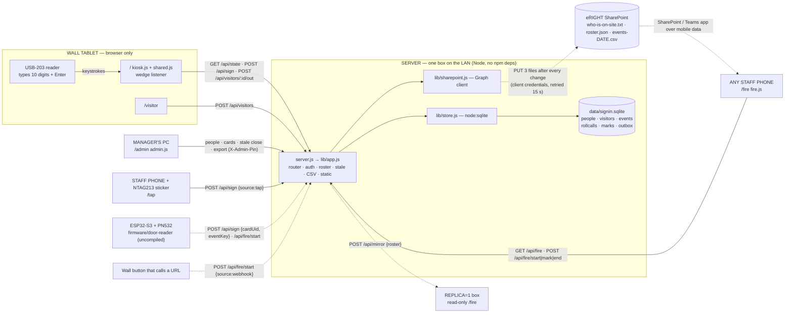

# eRIGHT Sign-In v3.2 — staff & visitor register with fire roll call

Small LAN system for a single door: 8 staff, visitors, and — because eRIGHT has **no designated
fire marshal** — a register that anyone at the assembly point can open on a phone and that is
copied off-site automatically after every change. Node 22.13+ only; no npm dependencies, no build
step. Data is SQLite (Node's built-in `node:sqlite`).

Built 2026-09-25 from the original SigninApp (`tobygladman2/SigninApp` commit `6eab63a`, shared-server
kiosk) plus the useful bits of the separate Home Presence project: SQLite persistence, event IDs for
idempotent retries, API tokens for devices, a mirror/replica, an ESP32 door reader, and a device column
on every event. Deliberately **not** taken from Home Presence: camera motion, BLE presence, geofencing,
and the inferred "auto-away" sign-out — a fire register must only change when a human acts.
The original one-file JSON version is preserved in git history (`git show 6eab63a:server.js`).

## Repository and history

| Commit | Date | What |
| --- | --- | --- |
| `6eab63a` | 2026-09-23 | Toby Gladman's original SigninApp: one JSON file, kiosk, admin, NFC `/tap` |
| `9fd70dc` | 2026-09-25 | Read-only `/rollcall` page and amber "signed in before today" flag added to the original |
| `588942d` | 2026-09-25 | Full v3 rewrite: SQLite, visitors, fire roll call, cards, mirror, admin PIN, tests |
| `b0c1c6f` | 2026-09-25 | README: history table and first-run checklist |
| `bf3ec40` | 2026-09-25 | README: card reader identified and verified facts recorded |
| `bfb38e9` | 2026-09-25 | v3.1: SharePoint off-site copy via Microsoft Graph, per-sink outbox |
| `0836ed2` | 2026-09-25 | README: v3.1 no-marshal framing, data-flow diagram, health fields |
| (next) | 2026-09-25 | v3.2: Prometheus `/metrics` (counts only), lone-worker flag, ALL SAFE state — so the estate's Prometheus/Alertmanager on platform-a watches the register (see "Estate integration") |

Home: `https://github.com/tobygladman2/SigninApp` (also mirrored at `otherlands/SigninApp`; the
development clone's `origin` has both as push URLs so one push updates both).
Developed for eRIGHT Ltd, 8 staff, one door.

## First run checklist

1. Install Node 22.13 or newer (`node --version`). Developed and tested on 24.13.1.
2. `npm test` — expect `pass 15`.
3. Set `ADMIN_PIN` and `API_TOKEN` before exposing the server to the office LAN (see `deploy/`). Give the server a fixed IP or hostname.
4. `npm start`, open `/admin`, set the company name and fire notice, add the staff.
5. Put `/` on the door tablet in fullscreen. Put `/fire` on **every** staff phone's home screen (there is no single marshal) and print a QR code to it for the assembly-point sign.
6. Set the `SP_*` variables so the register is copied to SharePoint after every change (see "SharePoint off-site copy"); confirm the first push in Admin → Off-site copies.
7. Delete any `data/` folder copied from a development machine before first real use; it holds test rows.
8. Back up `data/signin.sqlite` (and its `-wal` file) — it is the whole register. A small UPS on the server and router lets the last sign-outs reach SharePoint after the mains go.

## Pages

| URL | Who uses it | What it does |
| --- | --- | --- |
| `/` | Wall tablet by the door | One big button per staff member. Tap = toggle in/out. Shows visitors on site, on-site count, and a red banner while a roll call is running. Listens for a USB card reader. |
| `/visitor` | Visitor at the tablet | Name, company, who they're visiting, vehicle reg, fire-notice tick box. Issues a daily badge number. |
| `/fire` | Anyone's phone, any LAN device | Live "who is on site". **START ROLL CALL** freezes the register at that instant; then SAFE / MISSING per person with the ticker's name and time; counts of safe / missing / not yet seen; the banner turns **green "ALL n ACCOUNTED FOR"** the moment every person on the frozen register is marked SAFE; END writes a summary event. The live view says **LONE WORKER** when exactly one member of staff is on site with no visitors. If the server dies mid-fire the page shows the last register **that device** saw, clearly labelled — a fallback only, not relied on (see SharePoint). Print-friendly. |
| `/admin` | Manager's PC | Add/remove staff, assign card UIDs, close forgotten sign-outs, sign visitors out, company name, fire notice, event log, CSV export, roll-call history. Optional PIN. |
| `/tap` | Staff phone via NFC sticker | The original SigninApp's zero-hardware path: sticker URL → phone remembers who you are → each tap toggles you. |

## Run

```powershell
npm test          # 15 tests, in-memory SQLite + fake Graph, ~0.3 s
npm start         # http://<ip>:3000
```

Environment variables (all optional):

| Var | Purpose |
| --- | --- |
| `PORT`, `HOST` | default 3000 on all interfaces |
| `ADMIN_PIN` | required in `X-Admin-Pin` header for /admin write routes, export, events. Kiosk and fire page never need it. |
| `API_TOKEN` | required in `X-Api-Token` for device sources (`card`, `esp32`, `api`) and alarm-triggered roll calls (`alarm`, `webhook`). Human sources (`kiosk`, `tap`, `fire-page`) never need it. |
| `MIRROR_URL`, `MIRROR_TOKEN` | main server pushes a roster snapshot to the mirror after every change (queued in SQLite, retried every 15 s). |
| `REPLICA=1` | this instance is the read-only mirror. Serves `/fire` from the last snapshot and can run its own roll call. Refuses sign-ins. |
| `TZ_NAME` | IANA zone for "today" and CSV times, default `Europe/London`. |
| `SP_TENANT_ID`, `SP_CLIENT_ID`, `SP_CLIENT_SECRET`, `SP_SITE`, `SP_DRIVE`, `SP_FOLDER` | **SharePoint off-site copy** — see the section below. All four of tenant/client/secret/site must be set for it to switch on. |

Data lives in `data/signin.sqlite` (+ `-wal`), git-ignored. Back it up. `deploy/` has systemd
units for main and mirror.

## SharePoint off-site copy (the "building is on fire" view)

The assembly-point problem: the register lives on a server inside the building, the building's
power and Wi-Fi are gone, and there is no designated marshal whose phone might have cached the
fire page. So the server must push a copy **out**, automatically, on every change, to somewhere
every member of staff can already open on a phone. For eRIGHT that is the company SharePoint.

**What the server writes**, into one folder in a document library, after every sign-in, sign-out,
visitor change and roll-call action (queued in SQLite, flushed within 15 s, retried until it gets
through, and superseded snapshots are collapsed so a long outage does not replay hundreds of uploads):

| File | What it is for |
| --- | --- |
| `who-is-on-site.txt` | Plain text, readable in the SharePoint/Teams app preview on any phone: count, staff with "in since", visitors with company/host/vehicle/badge, forgotten-sign-out warnings, and a banner if a roll call is running. |
| `roster.json` | The same data for anything that wants to read it programmatically. |
| `events-YYYY-MM-DD.csv` | Today's full event log, rewritten on every change; yesterday's file stays as the archive. |

**One-off setup (needs someone with Microsoft Entra admin rights on the eRIGHT tenant):**

1. In Entra admin centre → App registrations → New registration. Name it e.g. `eRIGHT Sign-In Server`. No redirect URI. Note the **Application (client) ID** and **Directory (tenant) ID**.
2. Certificates & secrets → New client secret. Copy the **value** immediately; it is shown once.
3. API permissions → Add → Microsoft Graph → **Application** permissions. Least privilege is `Sites.Selected`, then grant that app write access to the one site (a Graph `POST /sites/{site-id}/permissions` by an admin). If that is more than you want to do, `Files.ReadWrite.All` (application) also works but lets the app write to every library in the tenant. Either way click **Grant admin consent**.
4. Create the folder in the library, e.g. `eRIGHT Ltd/Sign-in`. Set on the server:
   ```
   SP_TENANT_ID=<tenant id>   SP_CLIENT_ID=<client id>   SP_CLIENT_SECRET=<secret value>
   SP_SITE=eright.sharepoint.com:/sites/<SiteName>      # hostname:/server-relative-path of the site
   SP_DRIVE=                                             # blank = the site's default "Documents" library; or a library display name
   SP_FOLDER=eRIGHT Ltd/Sign-in
   ```
   (Put these in `/etc/eright-signin.env`, chmod 600, alongside `ADMIN_PIN` and `API_TOKEN`.)
5. Start the server, sign someone in, and within 15 s check Admin → **Off-site copies** (or `GET /api/health` → `sharepoint.last`). It shows the last push time and either the three file paths or the exact Graph error.
6. On a phone, open the SharePoint or Teams app, navigate to the folder, tap `who-is-on-site.txt`. Put a shortcut to that folder on every staff phone and a QR code to it on the assembly-point sign.

**Verified:** the whole path — token request, site lookup, default or named library, folder creation on upload, the three files, snapshot collapsing, failure handling and status reporting — runs against a fake Graph endpoint in `test/sharepoint.test.js` (5 tests). **Not yet verified:** a real tenant. Nobody has yet run this against eRIGHT's SharePoint, so step 5 is where the first real evidence will come from. Also unverified: how the SharePoint mobile app previews `.txt` on your phones — check it once and, if it is poor, say so and the server can write a `.csv` or `.docx`-friendly form instead.

**Limits to be clear about:** this is read-only at the assembly point — people can see the list, not tick names off. It is as fresh as the last successful push before the power went, so a small UPS on the server and router is the cheapest reliability gain. Names and times are stored in your Microsoft tenant under your existing access rules.

## Fire-safety rules baked into the code

1. **One source of truth.** Every device reads the same server; nothing is stored only on a tablet.
2. **Only deliberate acts change the register.** Kiosk tap, card, NFC tap, visitor form, admin. No sensor inference.
3. **The roll call is a snapshot.** Starting it copies the roster into `rollcalls.roster_json`. People signing out during the evacuation do not disappear from the roll-call list (tested).
4. **Forgotten sign-outs are flagged, never auto-closed.** Anyone signed in before local midnight is amber on the kiosk and marked "⚠ signed in before today" on the fire page. Admin closes them by hand and the event says so. Over-count is the safe failure; silent under-count is not.
5. **The register must outlive the building.** The server pushes a copy to SharePoint (and optionally a `REPLICA` box) after every change, with nobody doing anything. The fire page's localStorage cache is a last-resort fallback only — with no designated marshal, no phone can be assumed to have it.
6. **Every event carries who/what/when/where.** `kind, subject, at (UTC), source, device, note`. CSV export has all of them.
7. **Retries are safe.** A device can resend the same `eventKey` and the person is not toggled back (tested).

## Hardware (pick what you like — cheapest first)

| Option | Cost class | Firmware? | Notes |
| --- | --- | --- | --- |
| **Wall tablet** running `/` in kiosk/fullscreen mode | you probably have one | no | Any Android/iPad/old laptop. Add to home screen — the manifest gives a "Fire roll call" shortcut. |
| **USB "keyboard-wedge" NFC/RFID reader** plugged into the tablet or a mini PC | tens of pounds | no | These readers type the card UID + Enter as if they were a keyboard. The kiosk detects the fast burst and posts `cardUid`. Set the token once via Admin → "Set card-reader token on this device". Assign cards in Admin by presenting the card with the cursor in the person's box. Unknown cards are logged and shown in Admin for one-click assignment. **Reader in use: YARONGTECH USB-203** (label: IC 13.56 MHz, USB, output format 8H10D-1). See "Card reader — what has been verified" below. |
| **NFC stickers** for `/tap` | pence | no | Write the URL `http://<server>/tap` to an NTAG213 sticker on the door frame (painted frame or wood, not the steel strike plate). Works with staff phones on the office Wi-Fi: first tap asks for your name and remembers it on that phone; every later tap toggles you in/out. Give the server a fixed IP or hostname **before** writing any stickers. Write and lock stickers with an NFC phone and a tag-writing app; the USB-203 cannot write tags (wedge readers are output-only). A PC/SC reader-writer such as an ACR122U-class device is optional for desk writing — do not issue any "writable UID" fobs bundled with such kits to staff, because the UID is the person's identity here. |
| **ESP32-S3 + PN532 door reader** (`firmware/door-reader/`) | ~£15 | yes | Posts card UIDs with a persistent `eventKey` counter; a held button starts a roll call; RGB LED shows result. **Not compiled in this workspace** — build with PlatformIO and bench-test first. |
| **Starting the roll call without touching the fire panel** (we have no access to it) | £0 – ~£20 | no | Three ways, in order of preference: (1) the **START ROLL CALL** button on `/fire` from any phone — this is the primary path and is what was tested; (2) a **stand-alone wall button at the exit or assembly point** — a Shelly Plus i4 / Shelly BLU Button / any device that can call a URL, configured to `POST /api/fire/start` with body `{"source":"webhook","by":"exit button"}` and header `X-Api-Token`; (3) the **hold-button on the ESP32 door reader**. All three are idempotent: a second press while a roll call is open returns `alreadyOpen` and changes nothing. If panel access is ever granted later, the same endpoint accepts a relay-driven trigger — nothing else needs to change. |
| **Second box for the mirror** | any spare Pi/VM | no | `REPLICA=1` + `MIRROR_TOKEN`. Gives a full working `/fire` (with SAFE/MISSING ticks) off-site. `/fire` has no login today, so an internet-facing replica needs a PIN or VPN first — not built. |
| **SharePoint copy** | £0 (existing M365) | no | Server pushes `who-is-on-site.txt`, `roster.json` and today's CSV to a SharePoint folder after every change. Staff open it in the SharePoint/Teams app. See "SharePoint off-site copy" above. |

### Card reader — what has been verified (2026-09-25)

| Check | Result |
| --- | --- |
| How Windows sees the USB-203 | "HID Keyboard Device", USB `16C0:27DB`, two HID collections, standard Microsoft HID driver, no vendor software |
| Output for one MIFARE Classic-type card, 4 presentations | `3175933060` every time, followed by Enter (Enter confirmed — it submitted a text box) |
| Second card | `1223519496` = `0x48ED6D08` — distinct from the first, also stable on repeat, so the reader tells cards apart and the server's one-card-one-person rule will hold |
| Format | `3175933060` = `0xBD4CE484`, 32 bits → a 4-byte UID printed as 10 decimal digits, exactly what the label's 8H10D means |
| Kiosk end-to-end with the physical reader | **Not yet done.** Only synthesised keydown events have been through the listener so far |
| Inter-keystroke gap vs the listener's 120 ms rule | **Not yet measured** |
| 7-byte-UID tags (NTAG213 stickers) on this reader | **Not yet tried.** Test that it types 10 stable digits and that two different stickers give different numbers before relying on it |

The kiosk's built-in check: present an un-enrolled card at `/` and it should say "Card 3175933060 is not assigned to anyone"; Admin then shows it under "Last unknown card seen". That single scan proves reader → browser listener → server → token together.

## How the data flows and where the code runs

Solid arrows are exercised today (tests or browser); dashed arrows are built but not yet proven on real hardware or a real tenant.



| Device | Runs | State kept there |
| --- | --- | --- |
| Server (Pi / mini PC / laptop, fixed IP) | `server.js`, `lib/*` | **the register** — `data/signin.sqlite` |
| Wall tablet + USB-203 | browser: `/`, `/visitor` | `localStorage.cardToken`, device name |
| Any staff phone | browser: `/fire` | last roster seen (fallback only), ticker's name |
| Manager's PC | browser: `/admin` | admin PIN for the session |
| Staff phone via sticker | browser: `/tap` | remembered person id |
| SharePoint | nothing of ours — files written by the server | the off-site copy |
| ESP32 door reader (optional) | `firmware/door-reader/src/main.cpp` | eventKey counter in NVS |
| Replica box (optional) | same Node code, `REPLICA=1` | last roster pushed + its own roll calls |

## API (for Home Assistant, Node-RED, Shelly, ESP32)

| Method | Path | Body / notes |
| --- | --- | --- |
| GET | `/api/health` | `{ok, version, replica, outbox, mirror, sharepoint:{configured, site, folder, last:{at, ok, files|error}}}` |
| GET | `/metrics` | Prometheus text exposition, **counts only — no names** (see "Estate integration"). No PIN or token: it is meant to be scraped. |
| GET | `/api/state` | full kiosk state |
| GET | `/api/roster` | who is on site now (staff + visitors) + `loneWorker` (exactly one staff, no visitors) |
| POST | `/api/sign` | `{personId}` or `{cardUid}`; optional `direction:"in"|"out"`, `eventKey`, `source`, `device`, `note` |
| POST | `/api/visitors` | `{name, company?, hostId?, vehicle?}` → 201 with badge |
| POST | `/api/visitors/:id/out` | |
| GET | `/api/fire` | open roll call (with marks) + live roster |
| POST | `/api/fire/start` | `{source, by?}` → 201, or 200 `alreadyOpen` |
| POST | `/api/fire/mark` | `{subjectType:"staff"|"visitor", subjectId, status:"safe"|"missing"|"clear", by?}` |
| POST | `/api/fire/end` | `{by?}` |
| POST | `/api/mirror` | replica intake, `{type:"roster", roster}` |
| admin | `/api/people` (GET/POST), `/api/people/:id` (PATCH name/cardUid/active, DELETE), `PUT /api/company`, `PUT /api/fire-notice`, `POST /api/stale/close`, `GET /api/events`, `GET /api/export?from&to`, `GET /api/fire/history`, `GET /api/visitors/history`, `POST /api/mirror/flush` | |

## Estate integration — the register on eRIGHT's monitoring rails (v3.2)

The building's other systems (servers, switch, air-con, power plugs) are watched by Prometheus +
Alertmanager on platform-a (`llm-cluster` repo, `ops-config/observability/`), which e-mails the team
through the Graph mail relay. v3.2 puts the sign-in register on the same rails, so three things that
used to depend on somebody happening to look are now **pushed**:

| What | Why it matters for safety | How |
| --- | --- | --- |
| **A roll call has started** | Everyone with e-mail on their phone hears about it within about a minute, including staff off site who can then stay away and phone in. | `signin_rollcall_open == 1` → alert `SigninRollCallOpen` (critical). Resolves when the roll call ends. |
| **Lone working out of hours** | One person alone in the building in the evening is a recognised risk; today nothing notices. | `signin_lone_worker == 1` and `signin_local_hour` outside 07–18 for 30 min → `SigninLoneWorkerOutOfHours` (warning). Hours are a stated starting point, tune in the rule. |
| **The register itself is dark or its off-site copy is stale** | A fire register nobody can read at the assembly point is worse than none — you would trust it. | `up{job="signin"} == 0` → `SigninServerDown`; `signin_sharepoint_last_push_ok == 0` for 15 min → `SigninOffsiteCopyFailing`; `signin_stale_signins > 0` for 6 h → `SigninForgottenSignouts` (hygiene). |

**What `/metrics` exposes** (gauges; names of people are deliberately absent):
`signin_up`, `signin_replica`, `signin_staff_on_site`, `signin_visitors_on_site`, `signin_on_site_total`,
`signin_stale_signins`, `signin_lone_worker`, `signin_local_hour`, `signin_rollcall_open` and — only while one is
open — `signin_rollcall_{started_timestamp_seconds,total,safe,missing,unaccounted}`, `signin_outbox_depth`,
`signin_sharepoint_configured`, `signin_sharepoint_last_push_{ok,age_seconds}` (only after a first push),
`signin_events_last_24h`, `signin_started_timestamp_seconds`, `signin_info{version,tz}`.

**Wiring (in the llm-cluster repo, deployed by Alan on platform-a):** scrape job `signin` in
`ops-config/observability/prometheus.yml`, rule group `signin_safety` in `alert-rules.yml`, a hub tile,
and `scripts/deploy-signin-monitoring.sh`. The scrape needs a fixed address for this server (the Proxmox
VM "Sign-in testing" on the `hpe` node is the intended home; its IP was not on record when this was
written). Prometheus scrapes every 30 s, so "within about a minute" is the honest latency for the roll-call
alert; a direct webhook from `fireStart()` to Teams would be faster and is the obvious next step.

**Verified:** all series and the lone-worker / all-safe behaviour are pinned by `test/app.test.js`
(`/metrics exposes counts only …`). **Not yet verified:** a real scrape from platform-a and a real alert
e-mail — that is the first deploy's evidence.

## What is tested vs. what is not

Tested by `npm test` (all passing on Node 24.13.1): staff toggle and CSV; card sign-in, unknown
card capture, duplicate `eventKey`, double-assignment refusal; visitor badges and sign-out; roll
call snapshot immunity, marks, end summary; stale flagging and admin close; admin PIN scope;
main→mirror push and replica read-only behaviour; BST/GMT midnight; static serving and path
traversal; SharePoint sink (token, site, default/named library, three uploads, snapshot collapse,
upload failure, wrong secret, unconfigured) against a fake Graph endpoint. Driven by hand in a
browser: kiosk tap, roll call start/mark/end with red state, kiosk banner, admin card assignment,
wedge listener (synthesised keys). Physical reader: identified and its output format confirmed with
two cards (table above); kiosk end-to-end with it still owed.

Not tested: the physical card reader driving the kiosk page, the ESP32 firmware (never compiled), a physical webhook button,
the SharePoint push against a real tenant, iOS Safari specifics, and running for weeks (watch `data/` size; it is tiny per event).
There is no fire-panel integration: the roll call is started by a person (or a button a person
presses), never by the alarm itself.

## Known limits / next steps

- No per-person PIN: on a trusted door tablet anyone can tap anyone's name. Cards or `/tap` fix this if it matters.
- Admin PIN is a shared secret over plain HTTP on the LAN. Put it behind a reverse proxy with TLS if the network is not trusted.
- The mirror is a roster replica, not a full database replica; roll calls run on the mirror are stored on the mirror.
- The SharePoint copy is read-only at the assembly point: anyone can see who was inside, nobody can tick names off there.
- Decided against: running the server on an ESP32 (a full C++ rewrite that would still be inside the building) and a fire-panel relay (no access to the panel).
- Visitor pre-registration, contractor inductions, and photo badges are not built.
