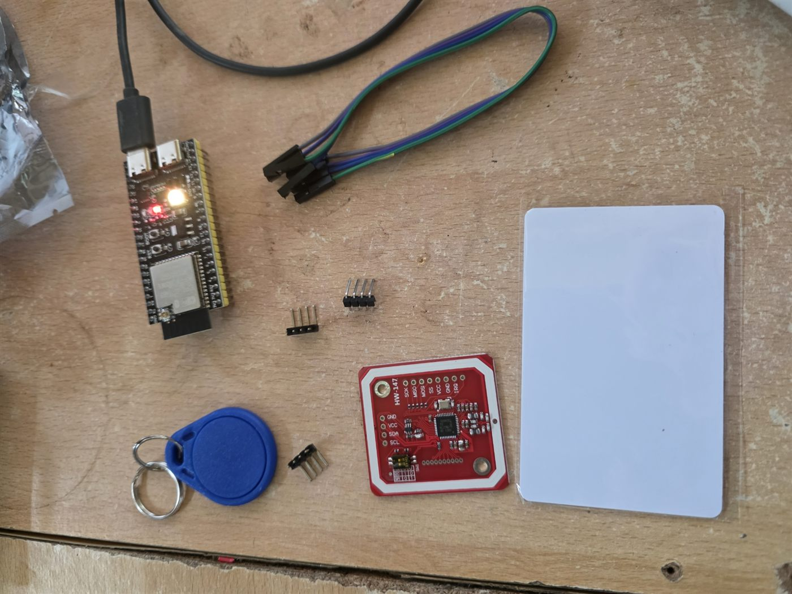
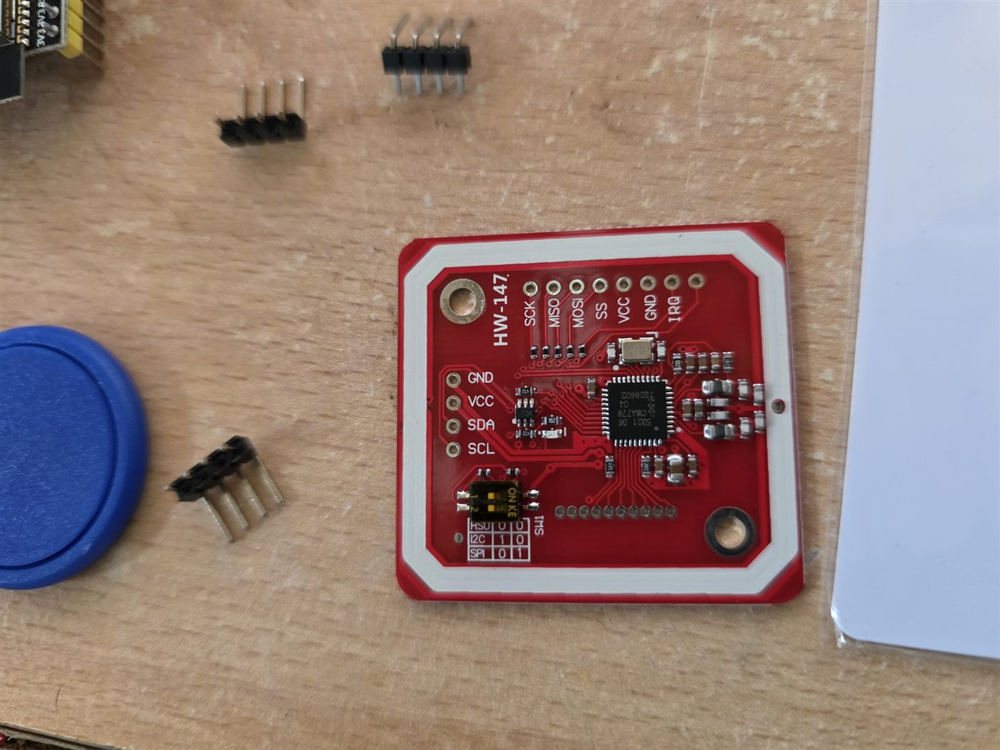
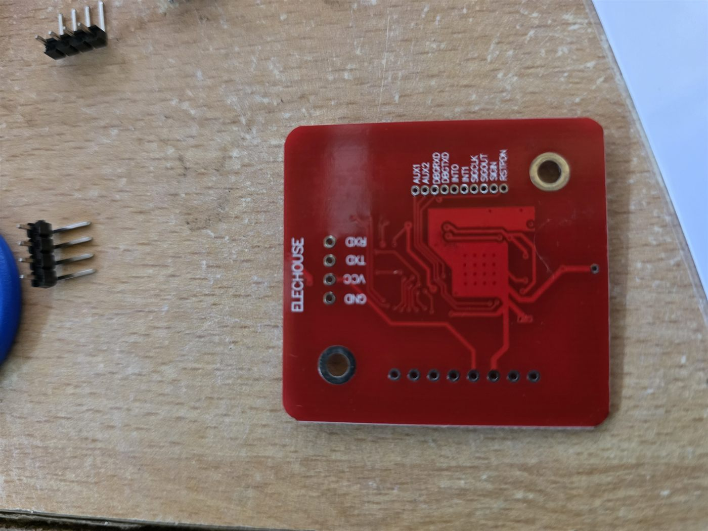

# eRIGHT back-door reader — build & wiring guide

Anyone in the office can build this in about 20 minutes with a screwdriver. **One soldering job**: the PN532 we
bought (Elechouse V3, marked HW-147, arrived 2026-09-27) ships with its header pins loose in the bag — the 4-pin
header must be soldered into the GND / VCC / SDA / SCL holes (the short row of four, see the photos) before anything else. Ten
minutes for anyone who has soldered before; taped or pushed-in pins are not reliable enough for a door reader.
Read the whole page once before touching anything.

**Where it lives (decided 2026-09-26):** the **back door**. The front door has the Raspberry Pi kiosk with the
USB card reader; this box is the independent second point — no screen, its own power, its own Wi-Fi — so a tap
at the back door signs you in or out just the same, and the red button there starts a roll call even if the
front kiosk is down. The event log shows `back-door-reader` on everything it does.

**What it does:** staff tap their card on the reader by the door and are signed in or out on the register.
Holding the red button for 1½ seconds starts a fire roll call from the door without touching a phone.
A little LED tells you what happened. It talks to the sign-in server (the Ubuntu container on the
Proxmox box, `http://192.168.101.102:3000`) over the office **IOT** Wi-Fi.

## What you need


*The kit as delivered (27 Sep 2026). Note the header pins are loose — they need soldering before step 1.*

| # | Part | Notes |
| --- | --- | --- |
| 1 | **ESP32-S3 dev board** (the one flashed 2026-09-25, MAC `14:c1:9f:d1:32:e4`) | Already has the firmware and Wi-Fi/server settings on it. Any ESP32-S3 DevKitC-style board works if reflashed. |
| 2 | **PN532 NFC module** (Elechouse V3 / HW-147, red board, 13.56 MHz, two tiny DIP switches) | Arrived 2026-09-27. Header pins come loose — solder the 4-pin one. |
| 3 | **Momentary push button** (normally open) — a big red arcade-style one is ideal | Any button that closes when pressed and opens when released. |
| 4 | **6 female-to-female jumper wires** (Dupont) | 4 for the PN532, 2 for the button. |
| 5 | **USB-C (or micro-USB) power** — a 5 V phone charger, 1 A is plenty | Powers everything. |
| 6 | A small box or 3D-printed case, double-sided tape | Optional but stops wires being knocked. |

You do **not** need a computer to build it. You only need one if something has to be re-flashed —
that is Alan's job, see "If it needs re-flashing" at the bottom.

## Before you start — the one thing that can go wrong

The PN532 module has **two DIP switches** (tiny sliders, usually labelled SEL0 and SEL1 or "1" and "2").
They choose how it talks. **It must be in I2C mode.** Look for the small table printed on the module
itself — it lists HSU / I2C / SPI against switch positions. Set the switches to the **I2C** row.
On the common red boards that is **switch 1 ON, switch 2 OFF**, but trust the table on your module,
not this sentence. If the switches are wrong the reader simply never appears; nothing is damaged.

Do this with the power **off** (USB unplugged).

## Step 1 — set the PN532 to I2C


*Front of the PN532 (HW-147). The four holes down the left edge — **GND, VCC, SDA, SCL** — are the ones we solder and use. The yellow DIP block and its table are bottom-left. The row along the top (SCK … IRQ) is SPI — leave it empty.*

1. Find the two DIP switches on the PN532 board (yellow block, bottom-left in the photo above, next to the 4-pin header).
2. Set them to the I2C position per the table printed on the board. **On our Elechouse V3 (HW-147) the printed table
   reads HSU = 0 0 · I2C = 1 0 · SPI = 0 1 — so switch 1 ON, switch 2 OFF** (confirmed from the module 2026-09-27).
3. Take a photo of the switches for the record.

## Step 2 — wire the PN532 to the ESP32 (4 wires)


*Back of the board — for identification only (Elechouse V3). Nothing is wired on this side; the GND/VCC/TXD/RXD pads at the top are the serial (HSU) option, which we do not use.*

Power **still off**. Use the **4-pin header** labelled **GND, VCC, SDA, SCL** (the one you soldered on — down the
left edge in the photo above). The 8-pin row (SCK / MISO / MOSI / SS / VCC / GND / IRQ) is for SPI — leave it empty.

| PN532 pin | → | ESP32-S3 pin | Wire colour (suggested) |
| --- | --- | --- | --- |
| **GND** | → | **GND** (any pin marked GND) | black |
| **VCC** | → | **3V3** (marked 3V3 or 3.3V — **not** 5V/VIN) | red |
| **SDA** | → | **GPIO 8** (marked "8") | green |
| **SCL** | → | **GPIO 9** (marked "9") | yellow |

Push each jumper firmly onto both pins. Tug gently — it should not fall off.

> Why 3V3 and not 5V: the PN532 board is happy on either, but its data lines then match the ESP32's
> 3.3 V logic. 5 V is only a problem if the module lacks a regulator; 3V3 is always safe.

## Step 3 — wire the fire button (2 wires)

| Button terminal | → | ESP32-S3 pin |
| --- | --- | --- |
| one terminal | → | **GPIO 4** (marked "4") |
| the other terminal | → | **GND** |

A push button has no polarity — either terminal to either pin. If your button has four legs
(two pairs), use one leg from **each** pair; if unsure, test with a multimeter in continuity mode:
pick two legs that beep **only** while pressed.

## Step 4 — power on and watch the LED

Plug the USB power in. The board's built-in RGB LED tells you the state:

| LED | Meaning |
| --- | --- |
| **purple** | connecting to Wi-Fi (first 10–20 s) |
| **dim blue** | ready — reader is idle and waiting for a card |
| **green flash** | card accepted: the person was signed in/out on the register |
| **orange flash** | card refused (unknown card, server unreachable, or the API token is wrong) — see step 6 |
| **red for 3 s** | roll call started from the button |
| **orange steady at boot** | PN532 not found — go back to steps 1–2 (switches or wiring) |

If the LED never goes dim blue after a minute, check the Wi-Fi: the board only joins the **IOT**
network. Moving it out of Wi-Fi range or the IOT network being down looks exactly like "purple forever".

## Step 5 — test it

1. **Button:** hold the red button for 2 seconds. LED goes red. On any phone open
   `http://192.168.101.102:3000/fire` — a roll call should be running, started by "door button".
   Press **END ROLL CALL** on the phone. (Proven 2026-09-25 22:58Z from a bench jumper.)
2. **Card:** tap a staff card on the PN532. If the card is not yet assigned to anyone the LED flashes
   orange — that is expected the first time. Open `http://192.168.101.102:3000/admin` (PIN from Alan);
   the card number appears under **"Last unknown card seen"**. Click **copy**, paste it into that
   person's **card UID** box and press Enter. Tap the card again → **green** and the kiosk shows them
   signed in. Repeat for each person and card.
3. Tap again → signed out. Tapping the same card twice within 2½ seconds is ignored on purpose.

## Step 6 — if something is not right

| Symptom | Likely cause | Fix |
| --- | --- | --- |
| Orange at boot, never blue | PN532 not seen | DIP switches not on I2C; SDA/SCL swapped or on the wrong pins; loose header/jumper; VCC on the wrong pin. Power off, re-check, power on. The board also retries every 30 s on its own. **The PN532's own LED being lit only proves VCC and GND — not the data wires.** |
| Orange, and the log says `[i2c] bus empty` | Nothing at all answers on the bus | Either the DIP switches are still on HSU (factory) → set 1 ON, 2 OFF and power-cycle; or SDA/SCL are not on GPIO 8/9 (read the tiny pin numbers next to the wires; swapped = empty too); or the header is not soldered so SDA/SCL float. Seen live 2026-09-27 on the bench. |
| Orange, and the log says `[i2c] 1 device(s) … 0x24` but still not found | Bus fine, chip odd | Power-cycle; if it persists the module may be faulty — try the other PN532 pins/board. |
| Purple forever | No Wi-Fi | Is the IOT network up? Is the reader within range? |
| Orange flash on every card, even assigned ones | Server unreachable or wrong token | Is `http://192.168.101.102:3000/` opening on a phone? If yes, the token on the board does not match the server — Alan reflashes (below). |
| Green but the wrong person signs in | Card assigned to the wrong name | Admin → that person's card box → type `CLEAR` + Enter, then re-assign. |
| Button does nothing | Wiring / not held long enough | Hold 2 full seconds. Check one leg is on GPIO 4 and the other on GND. |

Nothing here can hurt anything: the reader only *asks* the server to sign someone in; the register
itself lives on the server and is backed up to SharePoint.

## Mounting

Back door: put the PN532 where the card will be tapped (it reads through a few mm of plastic — a thin case
lid is fine, **not** through metal). Keep it away from the steel strike plate and door frame.
The ESP32 can sit behind it in the same box. The button goes wherever a person leaving in a hurry
will hit it — by the exit at shoulder height, clearly labelled **FIRE ROLL CALL — HOLD 2 s**.
Cable-tie the USB lead so a tug does not pull a jumper. Check the IOT Wi-Fi reaches the back door before
fixing anything to the wall: power the box there first and wait for the LED to leave purple.

## If it needs re-flashing (Alan / a PC with PlatformIO)

```powershell
cd "D:\eRIGHT\APPS\Access Lgging\V1\firmware\door-reader"
# config.h holds the Wi-Fi, server URL and API token (git-ignored). Then, with the board on a UART lead:
& "$env:USERPROFILE\.platformio\penv\Scripts\pio.exe" run -t upload --upload-port COM42
python tools\listen_door_reader.py COM42 40      # watch for [wifi] / [server] ... -> 200 / [nfc] ... ready
```

The board logs to both its native USB port and the UART lead. A healthy boot prints
`[server] http://192.168.101.102:3000/api/health -> 200` then a `[status]` line every 30 s. When the PN532 is not
found the firmware also scans the I2C bus and prints `[i2c] …` — `bus empty` = wiring/DIP problem; `0x24` seen = the
PN532 is wired and in I2C mode.

---
*Pins are those in `include/config.h` (SDA 8, SCL 9, button 4). Built and bench-tested 2026-09-25:
Wi-Fi, server health check and the fire button proven; first card read awaits the PN532 (Sat 26 Sep).*
